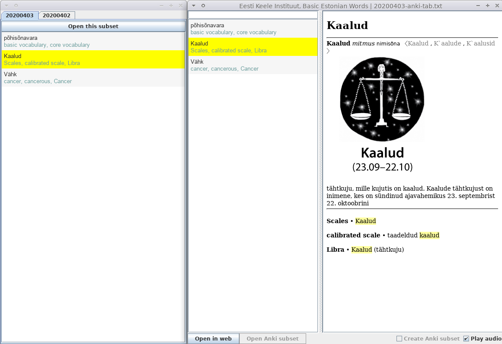

# eki-viewer

This is the repository to develop the viewer application for Basic Estonian Dictionary http://www.eki.ee/dict/psv/index.cgi

© Eesti Keele Instituut has the copyright of the dictionary data.
  - Dictionary data is available under the license of Creative Commons 4.0 https://www.eki.ee/litsents/ https://creativecommons.org/licenses/by/4.0/ (Main Basic Estonian Dictionary. keele põhisõnavara sõnastik 2014) or Public Domain Mark 1.0 https://creativecommons.org/publicdomain/mark/1.0/ (English-Estonian MT dictionary. Inglise-eesti sõnaraamat)

# application distribution


Distribution archive file contains dictionary data of text and media altogether as well as the dictionary viewer.

# dictionary viewer
An executable jar file for MacOSX and Linux, and Windows executable exe are bundled.




This application can work with a flashcard application named Anki, https://apps.ankiweb.net/.


You can import these subsets instead of the [entire data of Basic Estonian Dictionary](https://ankiweb.net/shared/info/245992522) to Anki.


# build from source (if you clone this repository)
```
docker run -it --rm -v ~/.m2:/root/.m2 -v "$(pwd)":/usr/src/mymaven -w /usr/src/mymaven maven:3.3-jdk-8 mvn clean compile assembly:single
docker run -it --rm -v ~/.m2:/root/.m2 -v "$(pwd)":/usr/src/mymaven -w /usr/src/mymaven maven:3.3-jdk-8 mvn package
```

Tools which were used to compile dictionary data are placed in [eki-tool](./eki-tool) directory.
